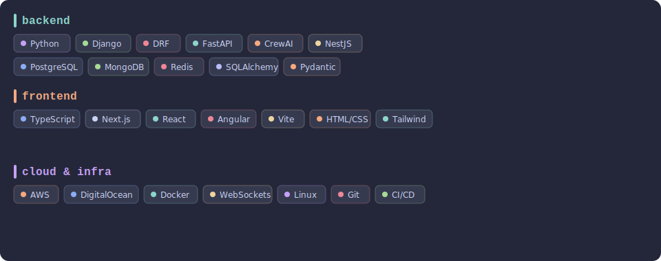
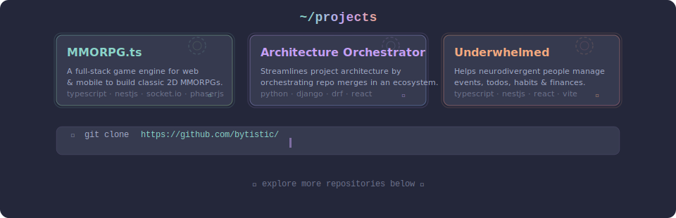

<!-- ===== HEADER SVG: Terminal typing + Space/Portal + Byte theme ===== -->

 

<!-- ===== BIO ===== -->

 

<!-- ===== STACK: Badges by category ===== -->

 

<!-- ===== CONTRIBUTION SNAKE ===== -->

<picture>
  <source media="(prefers-color-scheme: dark)" srcset="./assets/snake-dark.svg">
  <source media="(prefers-color-scheme: light)" srcset="./assets/snake-light.svg">
  
</picture>

 

<!-- ===== PROJECTS: Portal cards ===== -->

 

<!-- ===== CONTACT ===== -->

 

<!-- ===== FOOTER ===== -->

